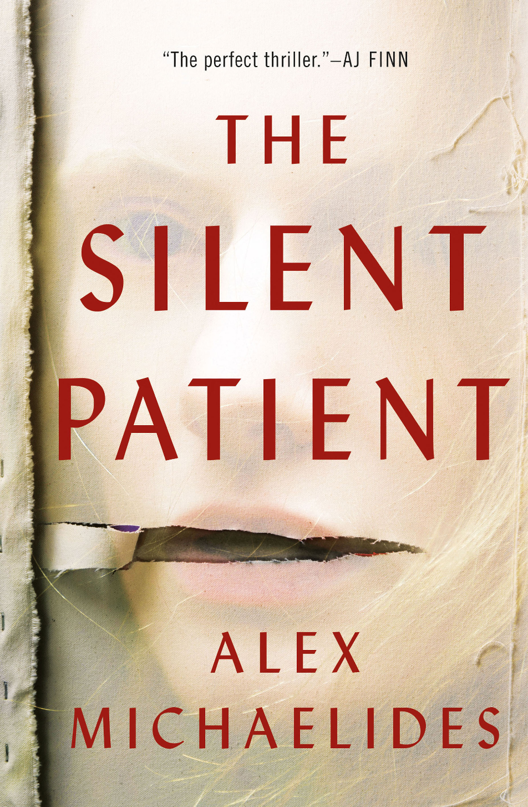

# Intro
In an attempt to get back into reading, I decided to pick up *The Silent Patient* by
Alex Michaelides, and boy was that a decision. When I used to work at a bookstore (that'll
be its own post, someday) and for about a week, every other customer had this book in their purchase,
which was how it came to my attention.

I'm just gonna get into the nitty-gritty, so obviously spoiler-alert, blahblahblah.

# Plot summary
Theo is a psychotherapist and he is obsessed with Alicia Berenson, the "silent patient."
Alicia was found by the police at her home, with a very very dead husband tied to the chair
with a hot gun sitting her feet. Every attempt to interrogate Alicia was fruitless, because,
as the title has you believe, she was silent! I mean, she's capable of talking, sort of...
She's not mute. Whatever, I'll explain it in a bit.

Theo signs up to work at The Grove, which is a psychiatric hospital/sort of jail. Like Arkham Asylum,
but in London, and not as crazy. Theo's plan is to become Alicia's psychotherapist because he's 
fascinated by her silence. He interviews, gets accepted, and quickly becomes her main
doctor.

# Time twist??!?!
So there are two main settings, one where Theo works in the hospital and one where he goes home to
his wife. While you are reading the book, it has you believe that the scenes at home happen directly
after Theo gets home from work. BUT PLOT TWIST! The events that take place at Theo's home happened YEARS ago,
well before Alicia was arrested.

At home, while his wife was away, presumably at work, Theo discovered an email chain from his wife
to an anonymous man. So he catches his wife cheating. It seems pretty obvious for him to divorce her now,
but alas Theo, our well adjusted character decides to stay. After a few more scenes, Theo builds up
confidence and decides to follow his wife and that's when he catches her, and some man, getting 
their spice on. Okay, for SURE he'll divorce her. NOPE, nah, nada. Actually, let's follow the man home!
Following through with this plan, Theo finds out, "Oh shit, that man HAS A WIFE??"

Instead of telling that woman that her husband is cheating, Theo stalks the house for days,
eventually breaks into the
house, ties up the wife, and waits for her husband to come home. Then when
the man comes home, Theo knocks him out and ties him to a chair so that he and his wife are
sitting back-to-back, unable to see each other.

Theo gives the man a choice, "Either you or your wife." The dude whimpers out, "But I don't want to die!"
Theo walks around and pretends to the shoot the wife, unties her rope, and then leaves the house.
But what Theo didn't expect was for the woman to shoot her husband dead.

...

Bro what? Aren't you a psychotherapist, he couldn't have possibly fathomed that happening?

PLOT TWIST AGAIN! The woman that shot her husband WAS ALICIA! My guy Theo was behind this the
whole time!

# Theo is an asshole
The whole book is about how Theo, so desperately curious about the mind of the woman
he, well, basically destroyed the life of, wants to save her. Save her from the silence.
"Cmonnn Alicia, why aren't ya talking??" I mean Theo eventually figures out it had something
to do with her childhood. But imagine if it had nothing to do with her childhood. Imagine
Theo does all that detective work for nothing, and shit IDK she was silent because she 
shot the fuck out of her husband! I'm sure that would cause enough distress for *ANYBODY*.

And then, once Theo realizes that Alicia recognizes him, HE FUCKING POISONS HER! I'm pretty
sure he meant to kill her, but she fell in a coma. Dude oh my god cmon.

# Thoughts
I hate Theo so bad. This dude sucks the shit out of an asshole. But the book overall is OK.
I think for a first read, after not having read in a while, it was decent. It was a page-turner
and the twist was definitely unexpected, even if it sort of comes out of nowhere. But I'd never
re-read it or seriously recommend it to anyone else. It portrays mental health in an
ignorant manner and uh yeah the MC sucks, which is OK and could be a very interesting
plot point in another book, but Theo sucks in a sad, boring way.

# Other thoughts
So there were a few things I noticed while reading the book. The book constantly brings up
the nationality/race of side characters. In most other most other books, this is innocent
by itself, but the way Alex mentions it feels tacky, like the author expecting the reader
to imagine people based on the caricature of their background.
