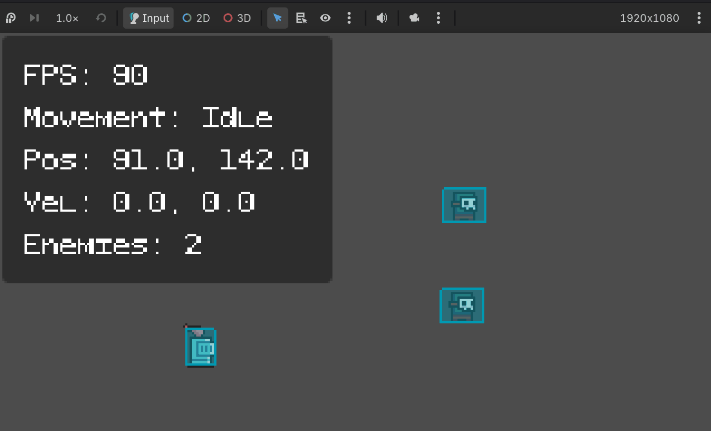
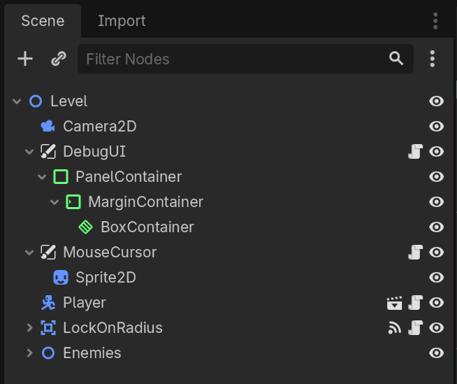
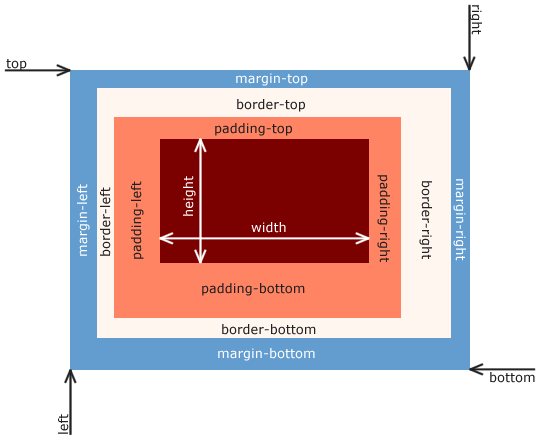

# Purpose
I didn't think it'd be necessary to create a UI for debugging, but
as I got further into game development, I noticed that keeping track of state
became more difficult.

While I *could* print information to the Godot debugger or terminal,
it would become noisy and I'd prefer to limit terminal information
to warnings and errors. Instead, I created a toggleable debug UI
that shows me information about the game and player's state.

Furthermore, this side development taught me two things: 1) the importance
of real-time state information and 2) UI development in Godot.

# How it works
When I looked up "UI for Godot" in Google, I was brought to the Control Node
section in Godot's documentation. Despite being informative, it was a little
terse without visual aid or any fundamental knowledge about UI.

Looking at Godot forums, I discovered other developers referencing
[Godot UI Basics - how to build beautiful interfaces that work everywhere (Beginners)](https://www.youtube.com/watch?v=1_OFJLyqlXI&t=1113s)
as a primer.

Godotneers, the author of the video, explains how to layer different control nodes
together to achieve different types of UI. If you've had experience with frontend
development before then UI development becomes easier to reason through,
since control nodes and CSS flexboxes are *very* similar.

My debug UI's setup is as follows...



As you can see,
there are four major components that dictate how my debug UI is laid out:

## 1. Canvas layer
The CanvasLayer provides a separate rendering layer for the UI. It is *not*
responsible for laying out the UI.

My reason for using a separate layer is because I didn't want my debug information
to become part of the game world. The UI should remain fixed to the viewport,
instead of moving with the game's regular 2D canvas and camera.

I did something very similar in my [previous post]()
with the mouse cursor.

## 2. Panel container
The PanelContainer is a type of Container that controls the layout of its child.
I used the PanelContainer as the outer boundary and background for my debug
info. Without a panel, I would have to manually position the children node.
As the game expands and more data needs to be tracked, manually positioning
everything would become monumentally more tedious.

## 3. Margin container


The MarginContainer's job is to create spacing around its child.
Without it, the debug info would sit directly against the edge of the panel.
This part is very similar to the way CSS padding works (see the above image).

## 4. Box container
Finally there's the BoxContainer. This is the node that arranges
my debug information, which is represented as labels.

Here, I set my box container to lay out its content vertically so that
the Labels stack up on each other. Having previously used CSS flexboxes,
learning how to use the BoxContainer felt very natural.

Here's how it'd look like in CSS.

```css
display: flex;
flex-direction: column;
```

# Coding up the labels
```gdscript
# debug_ui.gd
func _ready() -> void:
	visible = false
	labels.resize(LabelType.LABEL_TYPE_COUNT)
	for i in range(LabelType.LABEL_TYPE_COUNT):
		var label = create_label('test')
		labels[i] = label
		box_container.add_child(label)

func _process(delta: float) -> void:
	labels[LabelType.FPS].text = "FPS: %d" % Engine.get_frames_per_second()

	var moving = player.velocity != Vector2.ZERO
	labels[LabelType.PLAYER_STATE].text = "Movement: %s" % ("Moving" if moving else "Idle")

	labels[LabelType.POSITION].text = "Pos: %.1f, %.1f" % [player.position.x, player.position.y]
	labels[LabelType.VELOCITY].text = "Vel: %.1f, %.1f" % [player.velocity.x, player.velocity.y]
	labels[LabelType.ENEMIES_COUNT].text = "Enemies: %d" % enemies.get_child_count()

func create_label(text: String = "") -> Label:
	var label = Label.new()
	label.text = text
	label.theme = theme
	return label
```

Can't be a full write up if there isn't some code involved!
I currently have five states that I want to keep track of: 1) frames per second,
2) player movement state, 3) player position, 4) player velocity, and 5)
the number of enemies in the current scene.

The code is simple: Create a label, configure it, and attach it to the BoxContainer
as a child.

# A note on blurry text and resolution upscaling
A problem I noticed, and *still* is a problem, was rendering clear text.
My game renders at 320x180 but upscales six times to become 1920x1080.
My first suspicion was that the texture filtering setting was set to 'linear',
rather than 'nearest', but that actually doesn't matter.
The problem was actually the way TTF font was being rasterized.

TTF is a font format that uses mathematical outlines rather than fixed pixels
(like how my 16x16 sprite pixels work). This makes TTF fonts scalable,
but it means the glyphs have to be rasterized onto a pixel grid during rendering.

Disabling font features like antialiasing and hinting did make the text sharper,
but the problem is that I'm still rendering a TTF font, so the glyphs
aren't designed around my game's pixel grid setup.

Despite that, the debug UI is in a *good enough* state.
When I get to rendering in-game text, this is something I'll need to keep in mind.
