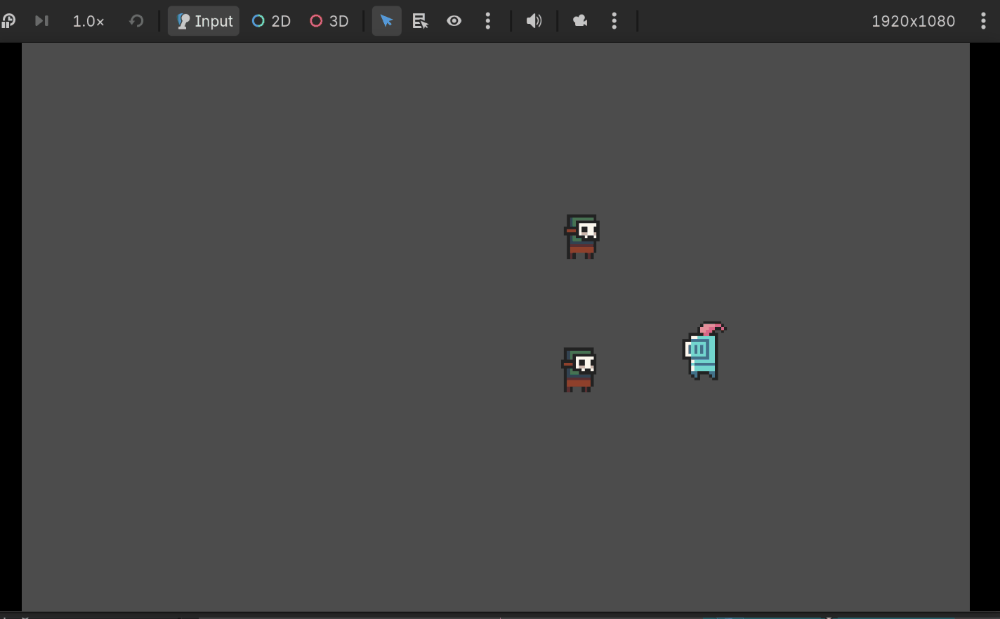
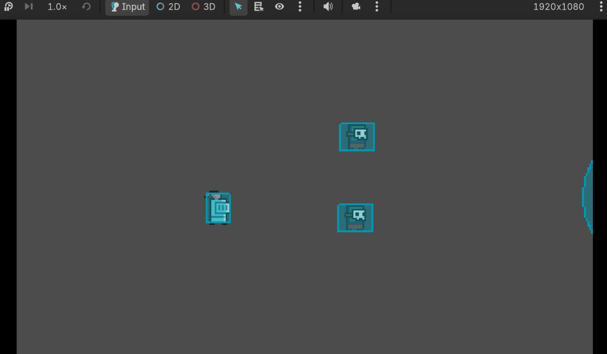

(A lil demo. BTW the art asset is a placeholder for now)

# Why?
Since my current game idea is to create a fast-paced action shooter,
I wanted the player to be able to actively select the closest enemy
and lock onto them.

I took some inspiration from *Hotline Miami*. By middle clicking,
the mouse position is locked onto whichever is deemed the closest
enemy (technical details below).

# How it works

(Demo with collision shape activated)

## Basic logic
My initial idea was pretty simple:
* Use an Area2D shape that radiates around the mouse.
* Check if it collides with an **Enemy** class.
* Lock onto the closest enemy when the player middle-clicks.

### Custom signals

Before Godot, the closest thing to signals I've used were callback functions in C++.
Otherwise, I wasn't very familiar with event-driven programming.

For nodes with a collision shape, Godot provides signals for when a body enters
and exits a collision radius. The implementation was simple: when a
body of type **EnemyBase** entered the collision body, the body gets stored
into a dictionary (map). And vice versa, if the body exits the collision radius, then it gets
removed from the map. In it's configuration, the boolean value doesn't matter,
since gdscript doesn't have a native set datatype.

```gdscript
# lock_on_radius.gd

var locked_on_enemies: Dictionary[EnemyBase, bool] = {}

# ... blah blah blah ...

func _on_body_entered(body: Node2D) -> void:
	if body is EnemyBase:
		var enemy := body as EnemyBase
		locked_on_enemies[enemy] = true

func _on_body_exited(body: Node2D) -> void:
	if body is EnemyBase:
		locked_on_enemies.erase(body)
```

### Finding the closest enemy
When the player middle-clicks to activate the lock-on mechanic, the program
loops over the dictionary that stores overlapping enemies and checks the distance between the current
enemy and the cursor position. If the current enemy is closer to the mouse, then the 
enemy variable gets updated to the current enemy.

```gdscript
func lock_onto_enemy() -> void:
	# search for enemies with a certain radius and lock onto the closest one within the radius
	# remove lock when player middle-clicks again
	if locked_on or locked_on_enemies.is_empty():
		locked_on = false
		locked_on_enemy = null
		lock_on_changed.emit(null) # custom signal
		return

	var closest_enemy: EnemyBase = null
	var closest_enemy_dist: float = INF

	var mouse_pos: Vector2 = get_global_mouse_position()

	# finds enemy closest to mouse
	for enemy in locked_on_enemies:
		var dist: float = mouse_pos.distance_to(enemy.global_position)
		if dist < closest_enemy_dist:
			closest_enemy = enemy
			closest_enemy_dist = dist

	locked_on = true
	locked_on_enemy = closest_enemy

	lock_on_changed.emit(locked_on_enemy) # custom signal
```

### Performance and bugs
I haven't tested it on multiple enemies nor overlapping enemies yet. If the problem starts
rearing itself, then I'll develop an update.

## Mouse cursor and texture effects
This was actually more difficult than I thought. In order to create a custom cursor
texture, I created a CanvasLayer node so that the mouse cursor appears above every other
object in the game.

The problem was that the cursor and game world were operating on separate coordinate spaces.
The enemy collision boxes were "off-centered", so using coordinates from the game
world was inaccurate with the cursor's true position.

I ended up converting the world space coordinates to the relative
screen-space coordinates before moving the cursor.

```gdscript
if locked_on_enemy:
    # need this to get proper screen coordinates
    var enemy_pos := get_viewport().get_canvas_transform() * locked_on_enemy.global_position
    sprite.position = enemy_pos
```
